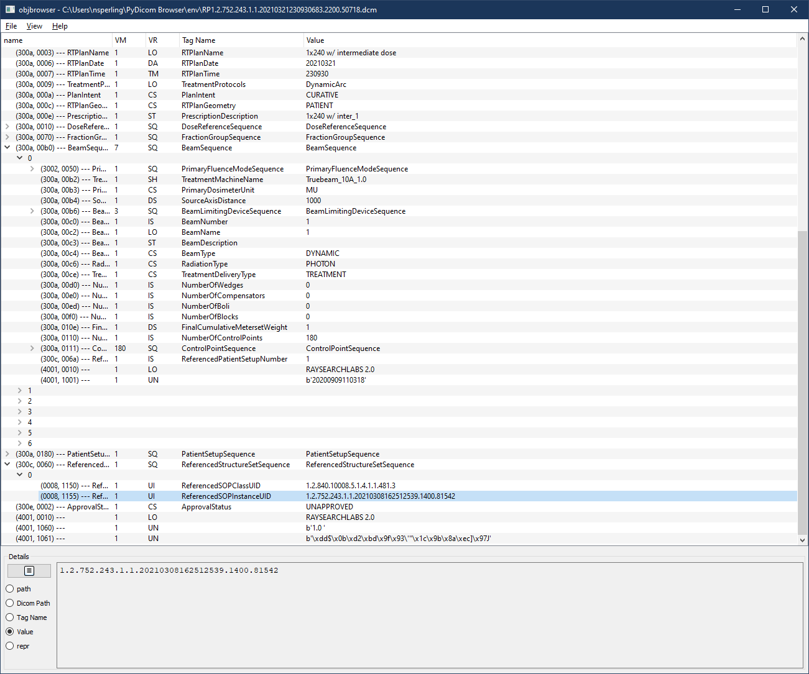

dicomobjbrowser
==========

Extension of the objbrowser Python object inspection tool to inspect and modify
DICOM files.

Displays DICOM files in same general interface as the objbrowser tool, allowing
you to view and (to a limited extent) modify DICOM files.  Depends on objbrowser
and creates new class DCMObj_Browser.  The DCMObj_Browser class may also be
called with any obj that can be parsed as a DICOM Dataset (in particular it
must be parsable by the DCMTreeModel and be derived from Dataset and 
DataElement objects from pydicom)

### Installation:

From the objbrowser readme:

First install
	    [PyQt](https://www.riverbankcomputing.com/software/pyqt/download5)
    or
	    [PySide](http://wiki.qt.io/Category:LanguageBindings::PySide::Downloads)

The object browser automatically detects which Qt bindings are installed. If both bindings are
installed it prefers PyQt over PySide. You can force the object browser to use a certain binding
by setting the `QT_API` environment variable to `pyqt5`, `pyqt4`, or `pyside`.

Then install the object browser with:

    %> pip install objbrowser
    
#### TODO: Add to pip.

or use the installer:

    %> python setup.py install


### User interface:




From the _File_ menu you can Open, Close, or Save the DICOM file being viewed,
if the viewer was launched editing a file.

The _View_ menu allows you to refresh the file, or object, as well as selecting
which columns should be displayed.

The main window displays DataElements with their VM, VR, and Human Readable
Tag Name (if it is known to pydicom, dicitonary extensions are possible as they
are in pydicom), along with the interpreted Value from\_\_str\_\_ for each DE.
Sequence elements are represented as expandable tree items with each element
in the sequence enumerated.

Any simple data elements (non SQ, and any whose VR is in the BINARY_VR_VALUES
but whose length is <= maxBytesToDisplay for the element) may be edited using
the details pane at the bottom.

The details pane at the bottom toggles between path (as used in pydicom), 
DICOM Path (as used in, e.g., dcmtk), Tag Name, Value, and repr (presenting
the results of the \_\_repr\_\_() on the DE).  When in Value presentation, the
Value may be edited by clicking on the notepad icon.  Clicking the Green Check
will accept the changes, while clicking the notepad again or clicking the Red X
will reject the changes.  No changes are made to the file unless it has been 
Saved using the menu or Ctrl+S; however, changes will be immediately reflected
by the DicomDataset object in memory.


### Usage examples:

The DCMObj_Browser class expects a DICOM DataSet object as the first parameter
and an optional name for the window as the second parameter.  Additional
parameters are derived from the objbrowser class.

```Python
from browser import DCMObj_Browser
import pydicom
dcmdata = pydicom.dcmread("RP.dcm")
DCMObj_Browser.browse(dcmdata)
```

The second parameter can be the name of the object or the filename. In that 
case the object itself will be displayed in titlebar.

```Python
DCMObj_Browser.browse(dcmdata, "RP.dcm")
```
